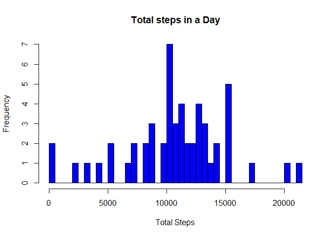
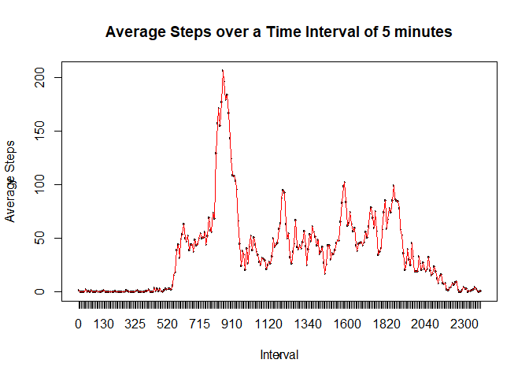
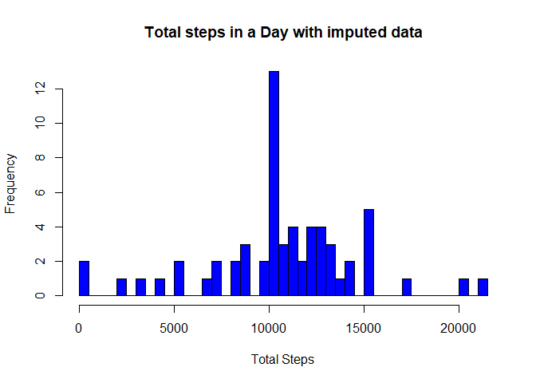
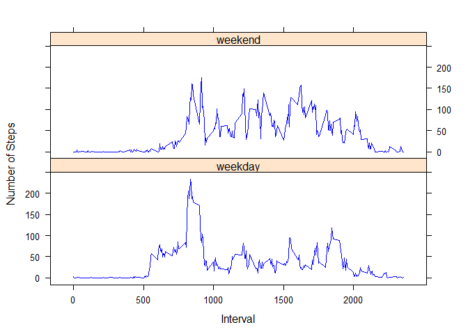

Including the libraries and suppressing the output of installation

```r
library(dplyr)
```

```
## Warning: package 'dplyr' was built under R version 4.0.5
```

```r
library(kableExtra)
```

```
## Warning: package 'kableExtra' was built under R version 4.0.5
```

```r
library(lattice)
```


## Loading and preprocessing the data
### Reading in the file activity.csv
Reading the file and making a copy of df to work with

```r
Act_df <- read.csv("activity.csv")
Act_pros_df <- Act_df
```

## What is mean total number of steps taken per day?
Creating a new column for day of week

```r
Act_pros_df$dow <- ifelse(weekdays(as.Date(Act_pros_df$date)) %in% c("Saturday", "Sunday"), "weekend", "weekday")
```

### Histogram of the total number of steps taken each day
The data is grouped on date using the group_by command
The sum of the steps taken each day is calculated using the summarise command

```r
x <- group_by(Act_pros_df, date)
y <- summarise(x, Daily_Steps = sum(steps), na.rm = TRUE)
hist(y$Daily_Steps, breaks = 50, col = "blue", main = "Total steps in a Day", xlab = "Total Steps")
```

<!-- -->

### Calculate and report the mean and median of the total number of steps taken per day
Using the same grouping as above


```r
y <- summarise(x, Mean_Daily_Steps = mean(steps, na.rm = TRUE), Median_Daily_Steps = median(steps, na.rm = TRUE), na.rm = TRUE)
disp_table <- select(y, -na.rm)
```

### Reporting in table format, the mean and median


```r
kable(disp_table, caption = " **Everyday Mean and Median**", col.names = c("Date", "Mean", "Median"), align = 
                            "ccc", "simple")
```


Table:  **Everyday Mean and Median**

    Date          Mean       Median 
------------  ------------  --------
 2012-10-01       NaN          NA   
 2012-10-02    0.4375000       0    
 2012-10-03    39.4166667      0    
 2012-10-04    42.0694444      0    
 2012-10-05    46.1597222      0    
 2012-10-06    53.5416667      0    
 2012-10-07    38.2465278      0    
 2012-10-08       NaN          NA   
 2012-10-09    44.4826389      0    
 2012-10-10    34.3750000      0    
 2012-10-11    35.7777778      0    
 2012-10-12    60.3541667      0    
 2012-10-13    43.1458333      0    
 2012-10-14    52.4236111      0    
 2012-10-15    35.2048611      0    
 2012-10-16    52.3750000      0    
 2012-10-17    46.7083333      0    
 2012-10-18    34.9166667      0    
 2012-10-19    41.0729167      0    
 2012-10-20    36.0937500      0    
 2012-10-21    30.6284722      0    
 2012-10-22    46.7361111      0    
 2012-10-23    30.9652778      0    
 2012-10-24    29.0104167      0    
 2012-10-25    8.6527778       0    
 2012-10-26    23.5347222      0    
 2012-10-27    35.1354167      0    
 2012-10-28    39.7847222      0    
 2012-10-29    17.4236111      0    
 2012-10-30    34.0937500      0    
 2012-10-31    53.5208333      0    
 2012-11-01       NaN          NA   
 2012-11-02    36.8055556      0    
 2012-11-03    36.7048611      0    
 2012-11-04       NaN          NA   
 2012-11-05    36.2465278      0    
 2012-11-06    28.9375000      0    
 2012-11-07    44.7326389      0    
 2012-11-08    11.1770833      0    
 2012-11-09       NaN          NA   
 2012-11-10       NaN          NA   
 2012-11-11    43.7777778      0    
 2012-11-12    37.3784722      0    
 2012-11-13    25.4722222      0    
 2012-11-14       NaN          NA   
 2012-11-15    0.1423611       0    
 2012-11-16    18.8923611      0    
 2012-11-17    49.7881944      0    
 2012-11-18    52.4652778      0    
 2012-11-19    30.6979167      0    
 2012-11-20    15.5277778      0    
 2012-11-21    44.3993056      0    
 2012-11-22    70.9270833      0    
 2012-11-23    73.5902778      0    
 2012-11-24    50.2708333      0    
 2012-11-25    41.0902778      0    
 2012-11-26    38.7569444      0    
 2012-11-27    47.3819444      0    
 2012-11-28    35.3576389      0    
 2012-11-29    24.4687500      0    
 2012-11-30       NaN          NA   


## What is the average daily activity pattern?
### Time series plot of the average number of steps taken
Making a time series plot (i.e. type = "l"\color{red}{\verb|type = "l"|}type = "l") of the 5-minute interval (x-axis) and the average number of steps taken, averaged across all days (y-axis)

Converting the integer interval variable to a factor in order to use group_by option

Summarising the mean based on the factored interval

Plotting the result of the summarised command


```r
Act_pros_df$fact_intv <- as.factor(Act_pros_df$interval)
x <- group_by(Act_pros_df, fact_intv)
y <- summarise(x, mean = mean(steps, na.rm = TRUE))

plot(y$fact_intv, y$mean, type = "n")
points(y$fact_intv, y$mean, col = "red", pch =".", type = "l")
title(main = "Average Steps over a Time Interval of 5 minutes", xlab = "Interval", ylab = "Average Steps")
```

<!-- -->

### The 5-minute interval that, on average, contains the maximum number of steps

Converting from a Factor to numeric is a bit tricky "as.numeric(levels(f))[f]"


```r
max_avg_steps <- max(y$mean)
timeInterval <- y$fact_intv[which(y$mean == max_avg_steps)]
timeInterval <- as.numeric(levels(y$fact_intv))[timeInterval]
timeInterval <- sprintf("%04d", timeInterval)
timeInterval <- as.character(strptime(as.character(timeInterval), "%H%M"), "%H:%M:%S")
print(paste("On an average the maximum number of steps happens during the interval ", timeInterval))
```

```
## [1] "On an average the maximum number of steps happens during the interval  08:35:00"
```


## Imputing missing values

Total no. of NAs in the data

```r
Tot_NA <- sum(is.na(Act_df$steps))
print(paste("Total number of NA in the original Data is", Tot_NA))
```

```
## [1] "Total number of NA in the original Data is 2304"
```
### Code to describe and show a strategy for imputing missing data

The activities on a weekday and weekend are usually different.
The mean number of steps for each interval on weekdays and weekends are derived.
The mean from weekend is substituted for NA for the weekend dates, similarly for weekdays too.

Weekday and weekend classification is present in the column "dow".
"dow" is converted to factor for using the group_by function.

2 vectors y2 and y3 contains the mean steps for each interval on a weekday and weekend respectively.
y2 is repeated 61 times (number of days) and is appended as Act_pros_df$mean_wkday.
y3 is repeated 61 times (number of days) and is appended as Act_pros_df$mean_wkend.
Act_pros_df$mean_wk is derived from the above 2 mentioned columns, whish has weekday values for dates with "weekday" as a factor, and weekend values for dates with "weekend" as a factor.

Finally, if NA is present in the Act_pros_df$steps column it is replaced with the corresponding entry in Act_pros_df$mean_wk and the value is rounded off.

A sample data is printed out comparing original steps value and the imputed steps value.


```r
Act_pros_df$fact_dow <- as.factor(Act_pros_df$dow)
x1 <- group_by(Act_pros_df, fact_intv, fact_dow)
y1 <- summarise(x1, mean = mean(steps, na.rm = TRUE))
y2 <- filter(y1, fact_dow == "weekday")
y3 <- filter(y1, fact_dow == "weekend")

Act_pros_df$mean_wkday <- rep(y2$mean,length(unique(Act_pros_df$date)))
Act_pros_df$mean_wkend <- rep(y3$mean,length(unique(Act_pros_df$date)))

Act_pros_df$mean_wk <- ifelse(Act_pros_df$fact_dow == "weekday", Act_pros_df$mean_wkday, Act_pros_df$mean_wkend)

Act_pros_df$steps <- ifelse(is.na(Act_pros_df$steps), Act_pros_df$mean_wk, Act_pros_df$steps)

Act_pros_df$steps <- round(Act_pros_df$steps)

check <- Act_df$steps
check <- as.data.frame(check)
names(check) <- "Original_Steps"
check$imputed_steps <- Act_pros_df$steps
print(head(check))
```

```
##   Original_Steps imputed_steps
## 1             NA             2
## 2             NA             0
## 3             NA             0
## 4             NA             0
## 5             NA             0
## 6             NA             2
```


### Histogram of the total number of steps taken each day
The data is grouped on date using the group_by command
The sum of the steps taken each day is calculated using the summarise command


```r
x <- group_by(Act_pros_df, date)
y <- summarise(x, Daily_Steps = sum(steps))
hist(y$Daily_Steps, breaks = 50, col = "blue", main = "Total steps in a Day with imputed data", xlab = "Total Steps")
```

<!-- -->

### Calculating New Mean and Median
Using the dataframe disp_table which contains the old mean and median
New mean and median appended to disp_table and printed as table


```r
x <- group_by(Act_pros_df, date)
y <- summarise(x, Mean_New_Steps = mean(steps, na.rm = TRUE), Median_New_Steps = median(steps, na.rm = TRUE), na.rm = TRUE)
disp_table$New_mean <- y$Mean_New_Steps
disp_table$New_median <- y$Median_New_Steps

kable(disp_table, caption = " **Everyday Mean and Median**", col.names = c("Date", "Old_Mean", "Old_Median", "New_Mean", "New_Median"), align = "ccccc", "simple")
```


Table:  **Everyday Mean and Median**

    Date        Old_Mean     Old_Median     New_Mean     New_Median 
------------  ------------  ------------  ------------  ------------
 2012-10-01       NaN            NA        35.3333333        24     
 2012-10-02    0.4375000         0         0.4375000         0      
 2012-10-03    39.4166667        0         39.4166667        0      
 2012-10-04    42.0694444        0         42.0694444        0      
 2012-10-05    46.1597222        0         46.1597222        0      
 2012-10-06    53.5416667        0         53.5416667        0      
 2012-10-07    38.2465278        0         38.2465278        0      
 2012-10-08       NaN            NA        35.3333333        24     
 2012-10-09    44.4826389        0         44.4826389        0      
 2012-10-10    34.3750000        0         34.3750000        0      
 2012-10-11    35.7777778        0         35.7777778        0      
 2012-10-12    60.3541667        0         60.3541667        0      
 2012-10-13    43.1458333        0         43.1458333        0      
 2012-10-14    52.4236111        0         52.4236111        0      
 2012-10-15    35.2048611        0         35.2048611        0      
 2012-10-16    52.3750000        0         52.3750000        0      
 2012-10-17    46.7083333        0         46.7083333        0      
 2012-10-18    34.9166667        0         34.9166667        0      
 2012-10-19    41.0729167        0         41.0729167        0      
 2012-10-20    36.0937500        0         36.0937500        0      
 2012-10-21    30.6284722        0         30.6284722        0      
 2012-10-22    46.7361111        0         46.7361111        0      
 2012-10-23    30.9652778        0         30.9652778        0      
 2012-10-24    29.0104167        0         29.0104167        0      
 2012-10-25    8.6527778         0         8.6527778         0      
 2012-10-26    23.5347222        0         23.5347222        0      
 2012-10-27    35.1354167        0         35.1354167        0      
 2012-10-28    39.7847222        0         39.7847222        0      
 2012-10-29    17.4236111        0         17.4236111        0      
 2012-10-30    34.0937500        0         34.0937500        0      
 2012-10-31    53.5208333        0         53.5208333        0      
 2012-11-01       NaN            NA        35.3333333        24     
 2012-11-02    36.8055556        0         36.8055556        0      
 2012-11-03    36.7048611        0         36.7048611        0      
 2012-11-04       NaN            NA        43.0763889        32     
 2012-11-05    36.2465278        0         36.2465278        0      
 2012-11-06    28.9375000        0         28.9375000        0      
 2012-11-07    44.7326389        0         44.7326389        0      
 2012-11-08    11.1770833        0         11.1770833        0      
 2012-11-09       NaN            NA        35.3333333        24     
 2012-11-10       NaN            NA        43.0763889        32     
 2012-11-11    43.7777778        0         43.7777778        0      
 2012-11-12    37.3784722        0         37.3784722        0      
 2012-11-13    25.4722222        0         25.4722222        0      
 2012-11-14       NaN            NA        35.3333333        24     
 2012-11-15    0.1423611         0         0.1423611         0      
 2012-11-16    18.8923611        0         18.8923611        0      
 2012-11-17    49.7881944        0         49.7881944        0      
 2012-11-18    52.4652778        0         52.4652778        0      
 2012-11-19    30.6979167        0         30.6979167        0      
 2012-11-20    15.5277778        0         15.5277778        0      
 2012-11-21    44.3993056        0         44.3993056        0      
 2012-11-22    70.9270833        0         70.9270833        0      
 2012-11-23    73.5902778        0         73.5902778        0      
 2012-11-24    50.2708333        0         50.2708333        0      
 2012-11-25    41.0902778        0         41.0902778        0      
 2012-11-26    38.7569444        0         38.7569444        0      
 2012-11-27    47.3819444        0         47.3819444        0      
 2012-11-28    35.3576389        0         35.3576389        0      
 2012-11-29    24.4687500        0         24.4687500        0      
 2012-11-30       NaN            NA        35.3333333        24     


## Are there differences in activity patterns between weekdays and weekends?

### Make a panel plot containing a time series plot of the 5-minute interval (x-axis) and the average number of steps taken, averaged across all weekday days or weekend days (y-axis)

xyplot command is used to generate the plot, which should appear same as in ReadMe file of this exercise
The library lattice needs to be included
The dataframe is grouped based on type of day (fact_dow) and the Interval
The output is summarised to find the mean number of steps for each 5 min interval
The scales in x axis needs to be adapted to replicate the graph in ReadMe file


```r
x <- group_by(Act_pros_df, fact_dow, interval)
y <- summarise(x, mean = mean(steps))

xyplot(mean ~ interval|fact_dow, data = y, layout = c(1,2), col = "blue", type = "l", xlab = "Interval", ylab = " Number of Steps", scales=list(x=list(at=c(0,500,1000, 1500, 2000), labels=c(0,500,1000, 1500, 2000))))
```

<!-- -->

